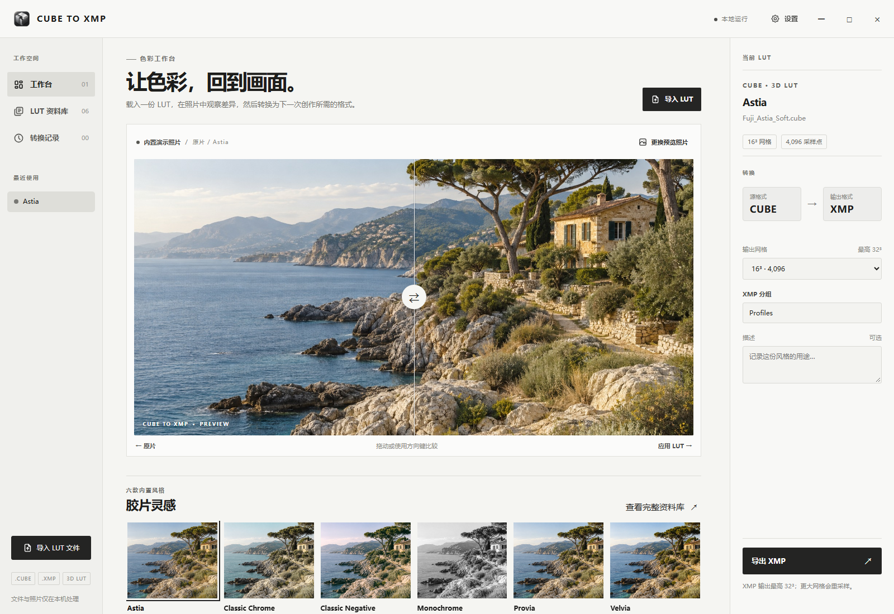
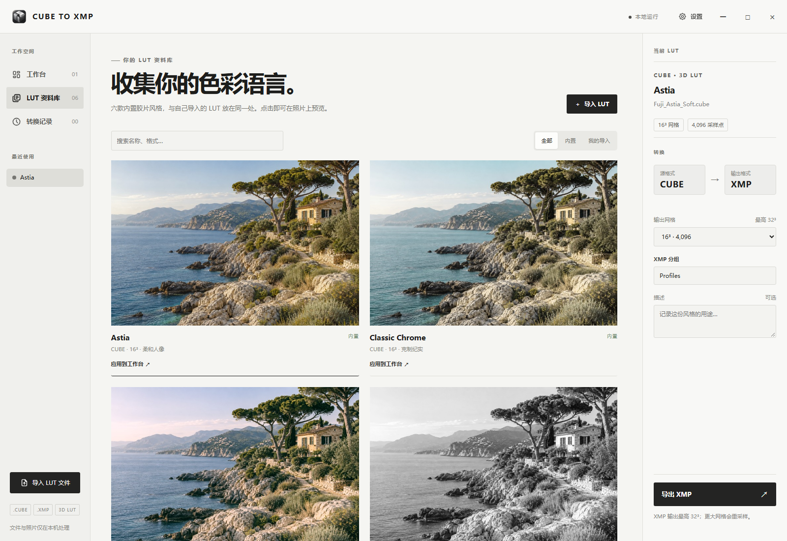

# CUBE TO XMP

**在照片上看见色彩，再把风格带到下一段创作。**

CUBE TO XMP 是面向摄影师和调色爱好者的本地 LUT 工作台。把 `.cube` 或带 Adobe RGBTable 的 `.xmp` 放进资料库，先在真实照片上判断色彩，再转换格式交给下一款软件。导入、预览和转换都在你的电脑上完成。

[下载最新版](https://github.com/OwenWhw/CUBE-to-XMP/releases/latest) · [各平台与旧版下载](docs/DOWNLOADS.md) · [English](README.en.md)



工作台把照片放在中心，右侧只保留当前 LUT 和导出设置。更换照片后，可以直接用自己的画面判断这份风格是否合适。

## 你可以做什么

| 场景 | 操作 |
| --- | --- |
| 先看效果 | 选择六款内置胶片灵感风格，或导入自己的 LUT；在演示照片或自己的照片上拖动分隔线比较。 |
| 整理 LUT | 一次导入多份 `.cube` / `.xmp`，在资料库搜索、筛选、应用和移除；导入的文件会复制到本地资料库。 |
| 转换格式 | CUBE → XMP、XMP → CUBE；选择输出网格，保存到指定位置。 |
| 找到结果 | 在「转换记录」中查看本次运行实际导出的文件，并打开所在文件夹。 |

界面提供简体中文和 English、浅色和深色主题，以及可关闭的动效。应用图标、窗口和资料库预览已统一为黑白灰的摄影工作台风格。



## 下载与运行

在 [v2.2.0 发布页](https://github.com/OwenWhw/CUBE-to-XMP/releases/tag/v2.2.0) 按系统下载。每个文件都遵循 `CUBE-TO-XMP-v版本-系统-架构.zip` 的命名规则。

| 系统 | 下载文件 | 解压后运行 |
| --- | --- | --- |
| Windows x64 | `CUBE-TO-XMP-v2.2.0-windows-x64.zip` | `CUBE-TO-XMP.exe`；保留旁边的 `_internal` 文件夹，需 Edge WebView2 Runtime。 |
| macOS Apple 芯片 | `CUBE-TO-XMP-v2.2.0-macos-arm64.zip` | `CUBE-TO-XMP.app`。 |
| macOS Intel | `CUBE-TO-XMP-v2.2.0-macos-x64.zip` | `CUBE-TO-XMP.app`。 |
| Linux x64 | `CUBE-TO-XMP-v2.2.0-linux-x64.zip` | 解压后运行 `CUBE-TO-XMP/CUBE-TO-XMP`；面向 Ubuntu 24.04 桌面环境构建。 |

解压时请保留完整目录。macOS 包尚未签名或公证，系统可能提示确认来源。各平台包和历史版本见 [下载说明](docs/DOWNLOADS.md)；发布页提供 `SHA256SUMS.txt` 供校验。无需安装 Python，照片和 LUT 不会上传。

## 三步完成一次转换

1. 在「工作台」点击「导入 LUT」，或从下方选择一款内置风格。右侧会显示源格式和输出格式。
2. 拖动照片上的分隔线比较效果。需要时点击「更换预览照片」，载入 JPG、PNG、TIFF 或 BMP。照片仅用于预览，不会被导出操作改写。
3. 选择输出网格，点击「导出 XMP」或「导出 CUBE」，在系统保存窗口选定位置。保存成功后可在「转换记录」找到文件。

快捷键：`Ctrl+O` 导入 LUT、`Ctrl+P` 更换照片、`Ctrl+S` 导出。聚焦对比照片后，可用方向键、`Home`、`End` 调整分隔线。

导入的 LUT 会复制到本机资料库；删除原始文件后，已导入的副本仍可使用。Windows 位于 `%LOCALAPPDATA%\CUBE TO XMP\Library`，macOS 位于 `~/Library/Application Support/CUBE TO XMP/Library`，Linux 位于 `~/.local/share/CUBE TO XMP/Library`（遵循 `XDG_DATA_HOME`）。

## 格式与兼容性

- CUBE 输入支持 2–65³ 的标准 **3D LUT**，输入域必须是 0–1；不支持 1D LUT。
- XMP 输入必须包含 Adobe RGBTable。普通 Lightroom / Camera Raw 滑块预设不属于可转换的 LUT。
- 输出网格可选 16、17、25、32、33、64、65。XMP 实际输出最高 32³；选择更大网格时会重采样为 32³。
- 照片预览基于 RGB 像素处理，是判断风格的参考。不同目标软件的色彩管理可能使最终效果略有差异；Adobe Camera Raw / Lightroom 中的实际兼容性仍待验证。

内置六款风格是胶片色彩灵感预设，不代表富士官方胶片模拟。

## 从源码运行

需要 Python 3.12，以及对应系统的 WebView 后端。Windows 使用 Edge WebView2；macOS 使用系统 WebKit；Linux 使用 Qt WebEngine。Windows 示例：

```powershell
py -3.12 -m venv .venv
.\.venv\Scripts\python.exe -m pip install -r requirements.txt
.\.venv\Scripts\python.exe cube_to_xmp.py
```

运行测试：

```powershell
.\.venv\Scripts\python.exe -m unittest discover -s tests -p 'test_*.py' -q
.\.venv\Scripts\python.exe tests\smoke_web_ui.py
```

打包：先安装 `pyinstaller`，再运行 `.\.venv\Scripts\python.exe build.py`。Linux 还需安装 `pywebview[qt]` 和 `PyQt6-WebEngine`。界面位于 `frontend/`，本地桥接位于 `web_studio.py`，转换逻辑位于 `conversion_service.py`、`lut_core.py`。详见 [转换说明](docs/CONVERSION.md) 和 [测试清单](docs/TESTING.md)。

[MIT License](LICENSE) · [v2.2.0 更新内容](docs/RELEASE_v2.2.0.md)
